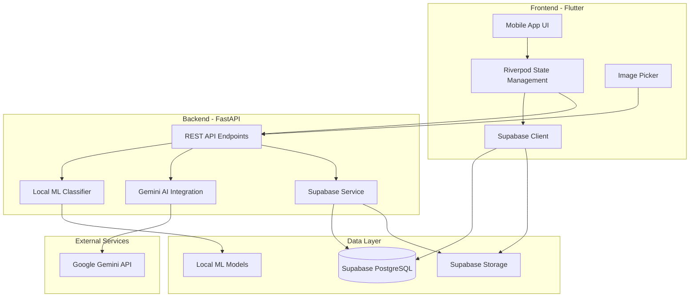
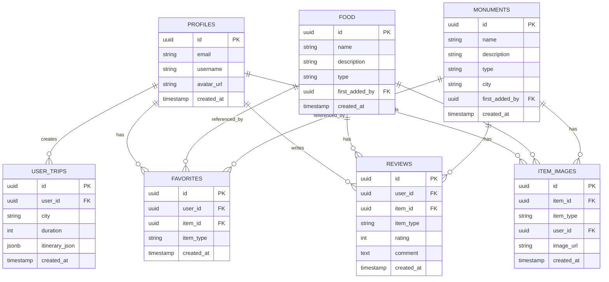

# 🇲🇦 MarocGuide AI - Smart Moroccan Tourism Mobile App

<div align="center">


**An intelligent mobile companion for exploring Morocco's rich culture, cuisine, and heritage**

[Features](#-features) • [Demo](#-demo) • [Architecture](#-architecture) • [Setup](#-quick-start) • [Contributing](#-contributing)

</div>

---

This project was the result of a collaboration with my friend FAHD EL ATTAR, and as we always say, with Zorbladi everything is superb.

## 🌟 Overview

**MarocGuide AI** is a cutting-edge mobile application that revolutionizes how tourists and locals explore Morocco. Powered by advanced AI and machine learning, the app provides instant recognition of Moroccan food and monuments, personalized travel itineraries, real-time translation to Darija (Moroccan Arabic), and smart cost estimation.

### 🎯 Why MarocGuide AI?

- 📸 **Instant Recognition**: Snap a photo of any Moroccan dish or monument and get detailed information instantly
- 🤖 **Dual AI Power**: Hybrid classification using local ML models (MobileNetV3) + Google Gemini AI
- 🗺️ **Smart Itineraries**: AI-generated personalized travel plans based on your interests and budget
- 💬 **Darija Translation**: Break language barriers with real-time Moroccan Arabic translation
- 💰 **Price Intelligence**: Get fair price estimates and haggling tips for local markets
- 🌐 **Offline-Ready**: Local ML models work without internet connectivity
- 👥 **Community-Driven**: Users contribute photos and reviews to build a comprehensive database

---

## ✨ Features

### 🍽️ Food Recognition & Discovery
- **AI-Powered Classification**: Identify Moroccan dishes from photos using MobileNetV3 or Gemini AI
- **Detailed Information**: Get descriptions, ingredients, cultural facts, and regional variations
- **Community Photos**: Browse user-contributed images of authentic Moroccan cuisine
- **Favorites System**: Save your favorite dishes for easy reference

### 🏛️ Monument Recognition & Exploration
- **Historical Insights**: Recognize landmarks and learn their history and significance
- **Location-Based Discovery**: Find monuments by city across Morocco
- **Cultural Context**: Understand the architectural styles and cultural importance
- **Photo Gallery**: Explore community-contributed images of each monument

### 🗺️ Intelligent Travel Planning
- **Custom Itineraries**: Generate day-by-day travel plans tailored to your preferences
- **Budget-Aware**: Plans adapt to low, medium, or high budget ranges
- **Interest-Based**: Focus on culture, food, adventure, relaxation, or mixed experiences
- **Save & Manage**: Store multiple trip plans and access them anytime

### 🌍 Language & Culture
- **Darija Translation**: Translate between English and Moroccan Arabic (Darija)
- **Latin & Arabic Script**: Get translations in both writing systems
- **Cultural Tips**: Learn local customs and etiquette

### 💵 Smart Cost Estimation
- **Fair Pricing**: Get realistic price ranges for items in different Moroccan cities
- **Haggling Tips**: Learn negotiation strategies for local markets
- **2026 Updated Prices**: Current market rates powered by AI

### 👤 User Features
- **Profile Management**: Personalized user accounts with Supabase authentication
- **Trip History**: Track all your saved itineraries
- **Contribution System**: Add photos and reviews to help other travelers
- **Favorites**: Bookmark foods and monuments you want to try or visit

---

## 🏗️ Architecture

### System Overview



### Tech Stack

#### Frontend (Flutter)
- **Framework**: Flutter 3.10+
- **State Management**: Riverpod 2.5+
- **Database Client**: Supabase Flutter 2.0
- **HTTP Client**: Dio 5.4
- **Image Handling**: Image Picker 1.0.7
- **Connectivity**: Connectivity Plus 7.0
- **Storage**: Shared Preferences 2.5

#### Backend (Python)
- **Framework**: FastAPI
- **AI/ML**: 
  - Google Generative AI (Gemini)
  - TensorFlow/Keras (MobileNetV3)
  - PIL (Image Processing)
- **Database**: Supabase Python Client
- **Environment**: Python-dotenv

#### Database & Storage
- **Database**: Supabase (PostgreSQL)
- **Storage**: Supabase Storage (S3-compatible)
- **Authentication**: Supabase Auth

### Database Schema



---

## 🚀 Quick Start

### Prerequisites

Ensure you have the following installed:

| Tool | Version | Download |
|------|---------|----------|
| **Flutter** | 3.10+ | [flutter.dev](https://flutter.dev/docs/get-started/install) |
| **Python** | 3.9 or 3.10 | [python.org](https://www.python.org/downloads/) |
| **Git** | Latest | [git-scm.com](https://git-scm.com/downloads) |

### 1️⃣ Clone the Repository

```bash
git clone https://github.com/othmanemrdev/Ai_Moroccan_Tourism_Smart_Mobile_app.git
cd Ai_Moroccan_Tourism_Smart_Mobile_app
```

### 2️⃣ Supabase Setup

#### Option A: Quick Test (Use Existing Project)
The app comes pre-configured with a demo Supabase instance. You can run it immediately for testing.

#### Option B: Your Own Project (Recommended for Production)

1. **Create a Supabase Project**
   - Go to [supabase.com](https://supabase.com) and create a free account
   - Create a new project

2. **Get Your Credentials**
   - Navigate to **Settings → API**
   - Copy your **Project URL**
   - Copy your **anon/public** key (for frontend)
   - Copy your **service_role** key (for backend - keep secret!)

3. **Set Up Database Schema**
   - Go to **SQL Editor** in Supabase dashboard
   - Run the schema creation script (contact maintainers for the full schema)
   - Create the following tables: `profiles`, `food`, `monuments`, `item_images`, `user_trips`, `favorites`, `reviews`

4. **Create Storage Buckets**
   - Go to **Storage** in Supabase dashboard
   - Create public buckets:
     - `food_photos`
     - `monument_photos`
     - `avatars`

5. **Get Gemini API Key**
   - Visit [Google AI Studio](https://aistudio.google.com/apikey)
   - Create a free API key for Gemini

### 3️⃣ Backend Setup

```bash
# Navigate to backend directory
cd backend

# Create virtual environment
python -m venv venv

# Activate virtual environment
# Windows:
venv\Scripts\activate
# macOS/Linux:
source venv/bin/activate

# Install dependencies
pip install -r requirements.txt

# Create .env file
# Copy the template below and fill in your credentials
```

**Create `backend/.env`:**
```env
SUPABASE_URL=https://YOUR_PROJECT_REF.supabase.co
SUPABASE_SERVICE_ROLE_KEY=your_service_role_key_here
GEMINI_API_KEY=your_gemini_api_key_here
```

```bash
# Start the backend server
python -m uvicorn main:app --reload --host 0.0.0.0 --port 8000
```

The backend will be running at `http://localhost:8000`

### 4️⃣ Frontend Setup

Open a **new terminal** window:

```bash
# Navigate to frontend directory
cd frontend

# Install Flutter dependencies
flutter pub get

# (Optional) If using your own Supabase project:
# Edit lib/main.dart and update Supabase.initialize() with your URL and anon key

# Run the app
# For web:
flutter run -d chrome

# For Android/iOS (with device/emulator connected):
flutter run
```

### 5️⃣ Optional: Local ML Models

For offline classification capabilities:

1. Download the pre-trained models (contact maintainers)
2. Place these files in `backend/models/`:
   - `Moroccan_Food_best_model.h5`
   - `Moroccan_Monument_best_model.h5`
   - `food_classes.json`
   - `monument_classes.json`

If models are not available, the app will automatically fall back to Gemini AI.

---

## 📱 Demo

### Screenshots

> 🎨 *Screenshots coming soon! The app features a modern, intuitive interface with:*
> - Beautiful image recognition screens
> - Interactive itinerary planning
> - Seamless translation interface
> - Rich monument and food galleries

### Key User Flows

1. **Recognize Food**: Take a photo → AI identifies dish → View details & save
2. **Plan Trip**: Enter preferences → AI generates itinerary → Save & manage
3. **Translate Darija**: Type phrase → Get instant translation in Latin & Arabic
4. **Estimate Costs**: Enter item & location → Get price range & haggling tips

---

## 🛠️ API Endpoints

### Classification
- `POST /classify-local` - Local ML model classification
- `POST /analyze-only` - Gemini AI analysis (no DB save)
- `POST /analyze-and-save` - Full analysis with database save

### Travel Planning
- `POST /generate-itinerary` - Create personalized travel plan
- `POST /save-trip` - Save itinerary to user account
- `GET /my-trips/{user_id}` - Retrieve user's saved trips
- `DELETE /trip/{trip_id}` - Delete a trip

### Translation & Pricing
- `POST /translate-darija` - Translate to/from Darija
- `POST /estimate-cost` - Get price estimates

### Media Management
- `POST /upload-photo` - Upload image to Supabase Storage

### Health Check
- `GET /health` - API health status

---

## 🤝 Contributing

We welcome contributions from the community! Here's how you can help:

### Ways to Contribute

1. **🐛 Report Bugs**: Open an issue with detailed reproduction steps
2. **💡 Suggest Features**: Share your ideas for new features
3. **📝 Improve Documentation**: Help make our docs clearer
4. **🔧 Submit Pull Requests**: Fix bugs or add features

### Development Workflow

```bash
# Fork the repository
# Clone your fork
git clone https://github.com/YOUR_USERNAME/Ai_Moroccan_Tourism_Smart_Mobile_app.git

# Create a feature branch
git checkout -b feature/amazing-feature

# Make your changes
# Test thoroughly

# Commit with clear messages
git commit -m "Add amazing feature"

# Push to your fork
git push origin feature/amazing-feature

# Open a Pull Request
```

### Code Style

- **Flutter**: Follow [Effective Dart](https://dart.dev/guides/language/effective-dart) guidelines
- **Python**: Follow [PEP 8](https://pep8.org/) style guide
- **Commits**: Use clear, descriptive commit messages

---

## 📄 License

This project is licensed under the **MIT License** - see the [LICENSE](LICENSE) file for details.

---

## 👥 Authors & Acknowledgments

### Development Team
- **FAHD** - [@fahdElattar](https://github.com/fahdElattar)
- **Othmane** - [@othmanemrdev](https://github.com/othmanemrdev)


### Special Thanks
- Google Gemini AI team for the powerful AI capabilities
- Supabase for the excellent backend infrastructure
- The Flutter community for amazing packages and support
- All contributors who help improve this project

---

## 📞 Contact & Support

- **GitHub Issues**: [Report bugs or request features](https://github.com/othmanemrdev/Ai_Moroccan_Tourism_Smart_Mobile_app/issues)
- **Documentation**: See [SETUP_GUIDE.md](SETUP_GUIDE.md) for detailed setup instructions

---

## 🗺️ Roadmap

### Current Version (v1.0)
- ✅ Food & monument recognition
- ✅ AI-powered itinerary generation
- ✅ Darija translation
- ✅ Cost estimation
- ✅ User profiles & favorites

### Upcoming Features
- 🔄 Augmented Reality (AR) monument overlays
- 🔄 Social features (share trips, follow users)
- 🔄 Offline map integration
- 🔄 Voice-guided tours
- 🔄 Restaurant recommendations & reservations
- 🔄 Multi-language support (French, Spanish, Arabic)
- 🔄 Weather integration for trip planning

---

## 🌟 Star History

If you find this project useful, please consider giving it a ⭐ on GitHub!

---

<div align="center">

**Made with ❤️ for Morocco 🇲🇦**

*Discover Morocco's beauty, one photo at a time*

[⬆ Back to Top](#-marocguide-ai---smart-moroccan-tourism-mobile-app)

</div>
